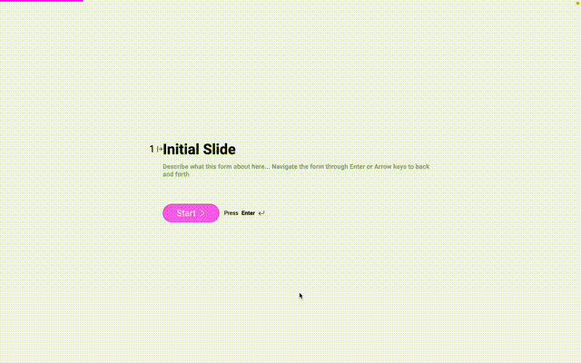
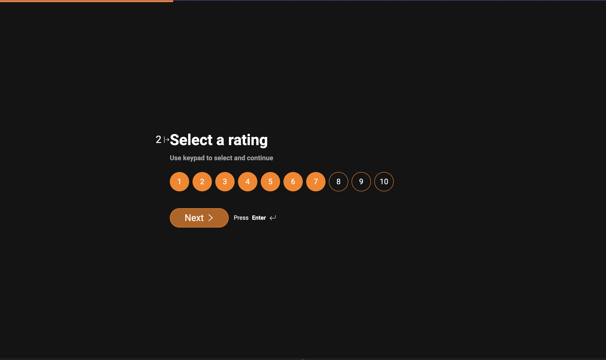

# DevForm

Create a easy to use form for the end user like typeform
and easy/free to deploy for the developer.
Made it as a svelte component to copy and paste in your project.

## Demo

## Sample **Theme**

### Features

- [x] Full keyboard navigation support
- [x] Support branding and custom styles
- [x] Element
  - [x] Short Text
    - [x] Email
    - [x] Custom validation
  - [x] Long Text
  - [x] Select
    - [x] Multiple
    - [x] Single
    - [ ] Custom keyboard selection like `Y` / `N`
  - [x] Rating element
    - [x] Number
    - [ ] Icon
      - [ ] Star
      - [ ] Heart
      - [ ] Thumbs up
      - [ ] Thumbs down
      - [ ] Custom Icon
  - [ ] Slider
    - [ ] Double range
  - [ ] Date picker
  - [ ] Time picker
- [ ] Custom element support
  - [ ] Register a unique element
- [ ] Form flow
  - [ ] Skip a slide
  - [ ] Add conditional logic
